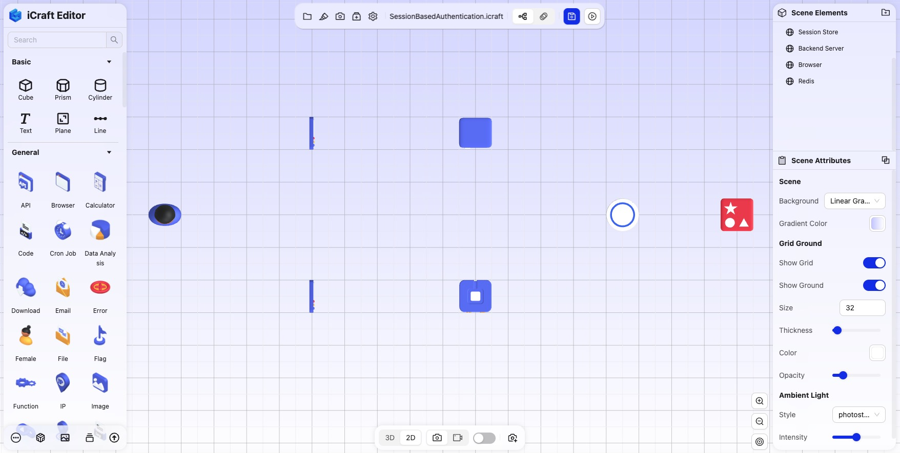
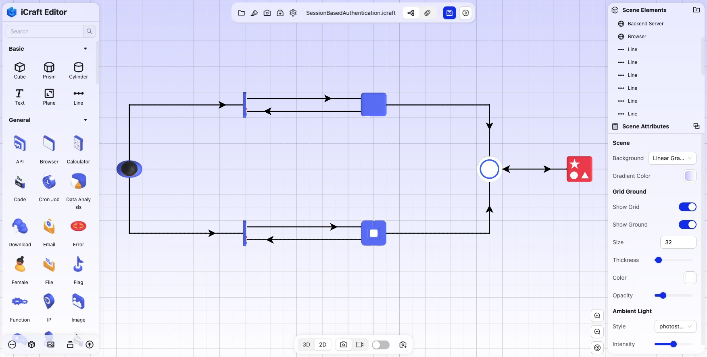
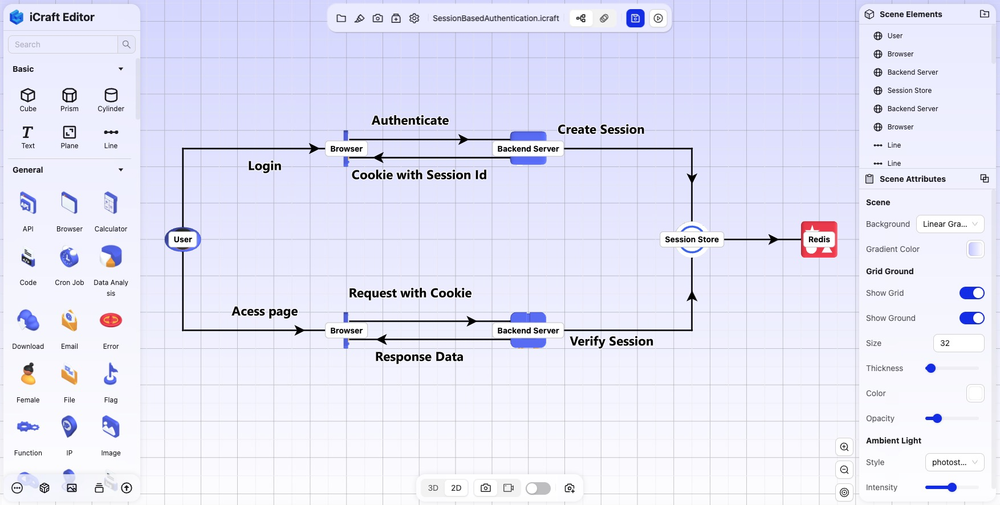
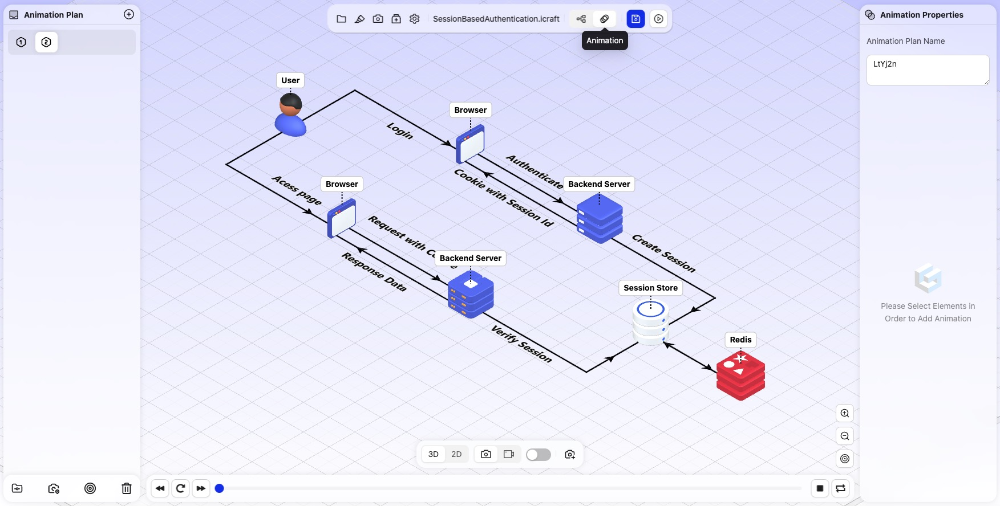
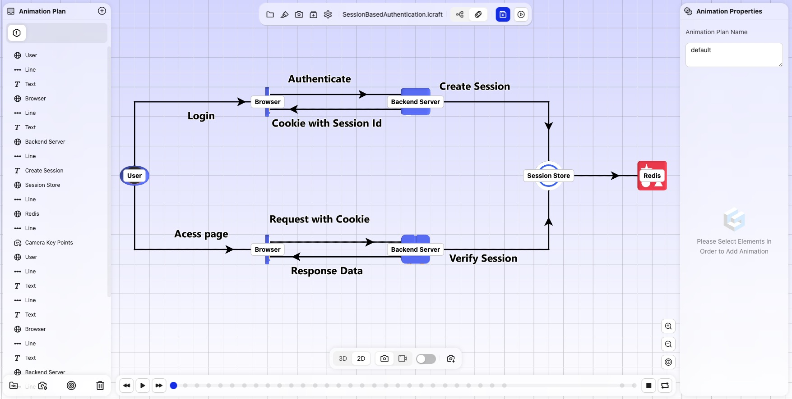
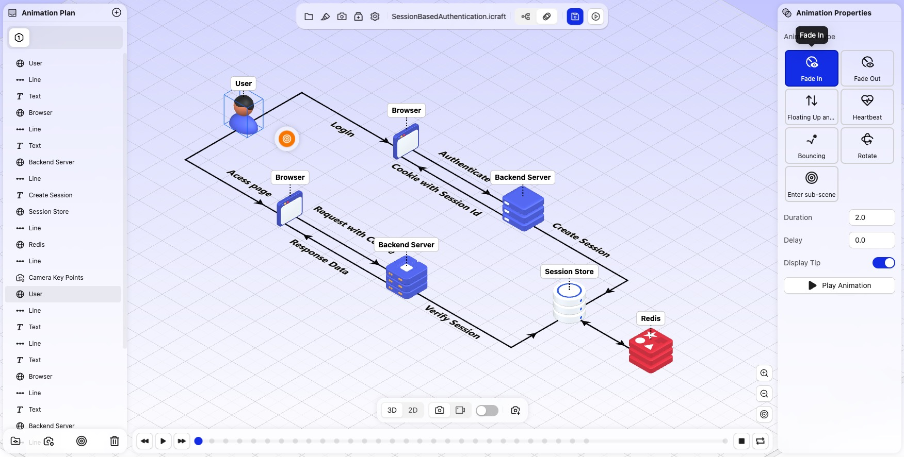
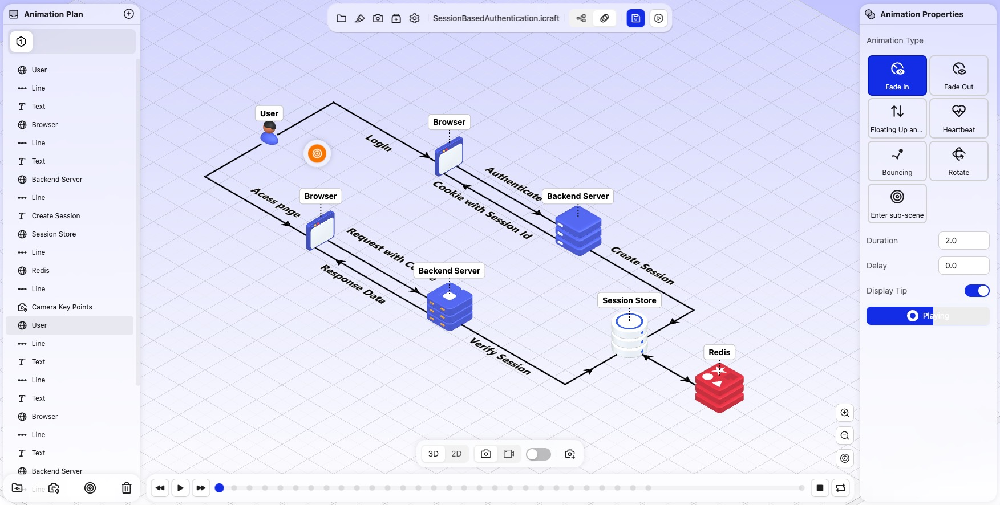
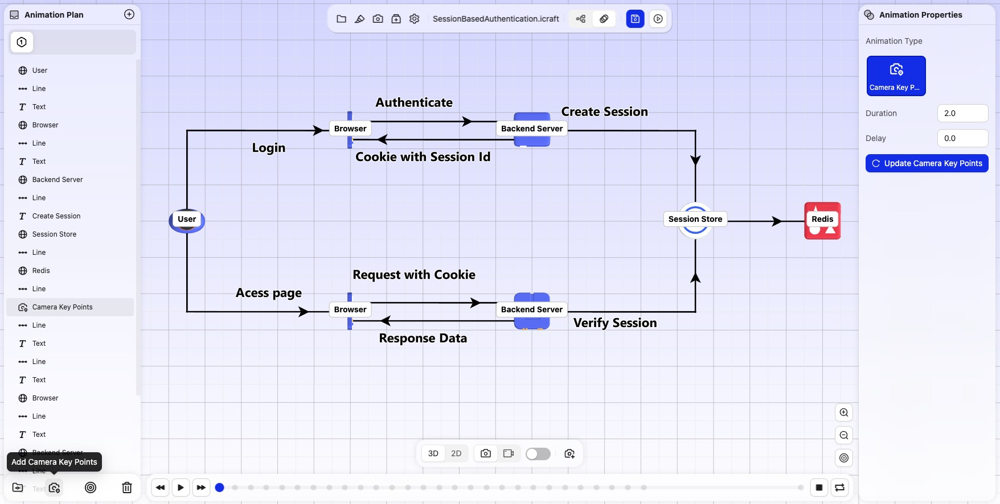

<!--
 * @Descripttion: 
 * @MainAuthor: 
-->

# 如何绘制可以动画的3D系统架构图

绘制支持动画的3D系统架构图可以带来许多额外的好处和优势，特别是在复杂系统的展示、分析和沟通中。

## 绘制支持动画的系统架构图的好处

#### 1. 动态展示系统流程和交互

	通过动画，系统架构图可以直观展示各个组件之间的交互流程。例如，微服务间的请求如何流动、数据如何在系统中传递等。动态展示比静态图更容易帮助理解系统的运行逻辑。

#### 2. 实时系统状态监控

	动画可以与实时数据集成，展示系统运行时的状态。例如，显示流量高峰时数据流动的速度、服务的响应时间、服务器的负载等。这对于运维、监控和系统优化提供了直观的可视化支持。

#### 3. 故障定位与分析

	通过动画效果，可以清晰地展示异常行为或瓶颈。例如，当某个模块崩溃或响应延迟，动画可以动态显示该模块的异常状态，帮助用户快速发现并定位问题。

#### 4. 增强的交互和用户体验

	动画可以让用户通过交互方式探索系统架构。例如，点击某个模块时，动画可以展示其内部的子模块或详细信息，或者高亮显示其与其他模块的依赖关系。这样的交互体验比传统的静态图更加生动、直观。

#### 5. 时间维度的展示

	动画允许展示系统在不同时间点的变化。例如，展示系统从启动到达到稳定状态的过程，或者回顾系统架构在某段时间内的演化，帮助用户理解系统的生命周期或历史变迁。

#### 6. 复杂流程的简化

	动画可以分步骤展示复杂流程，帮助用户逐步理解。例如，数据从用户请求到数据库存储的过程，可以逐步通过动画展现各个环节，避免一次性呈现全部信息所带来的信息过载。

#### 7. 增强的视觉吸引力

	动画具有吸引人的视觉效果，特别是在技术演示或产品展示时，能够帮助观众更好地理解系统架构。这不仅提升了展示的质量，也提高了观众的关注度和兴趣。

## 如何使用iCraft Editor来绘制支持动画的3D系统架构图

#### 1. 从左侧面板找到需要的技术组件，并拖拽放置到对应的位置上。

#### 2. 根据组件与组件之间的关系，用线条连接组件。

#### 3. 添加注解文字，描述组件的功能和用途，亦可选择性打开元素的悬浮文字提示。

此时，我们绘制好了一副静态的3D系统架构图，但它还不能展示动态的变化。

#### 4. 点击工具栏上的“动画”切换按钮，切换到动画编辑模式。

#### 5. 可以按快捷键V切换为俯视图，根据期望的动画顺序，依次点击技术组件、线条、文字等元素，对应的会在左侧面板中生成相应的动画节点，动画顺序就是节点的顺序，可以拖拽调整动画节点的顺序。

#### 6. 在动画节点的属性面板中，可以设置动画节点的动画类型、播放时长、延时时间等, 这里我们每个节点都用默认的动画类型，物体和文字默认是渐显效果，线条默认是绘制效果，也可以根据需要按需调整。

#### 7. 在动画节点的属性面板中点击“播放动画”按钮，即可看到该节点的动画效果。

  
#### 8.  如果需要并行动画，可以在左侧面板下方创建并行动画节点文件夹，把需要并行动画的节点放入文件夹中。如果需要在某个动画节点前切换视角，可以按Alt+鼠标左键拖动鼠标旋转到合适的视角，点击“添加相机关键点”即可添加一个关于相机位置的动画节点，当动画执行到该节点时，相机会自动切换到该节点的视角。

## 演示可以动画的3D架构图
#### 1. 在动画编辑模式下，点击预览按钮，然后点击播放按钮，即可连贯的看到架构图整体的动画效果。

#### 2. 也可以手动控制每个节点的播放，动画点击下一步按钮或者使用键盘光标键→来控制每个节点的播放。

## 推荐使用iCraft Editor
动画化的3D系统架构图不仅在视觉上具有更大的吸引力，还能通过动态演示、实时监控、交互式展示等方式，大幅提高系统架构的可理解性、可操作性和表现力。它适用于展示复杂的系统设计、进行实时监控、技术演示和团队协作等多个场景，有助于开发、运维、管理等不同角色更高效地理解和处理系统问题。

iCraft Editor 官网：https://icraft.gantcloud.com