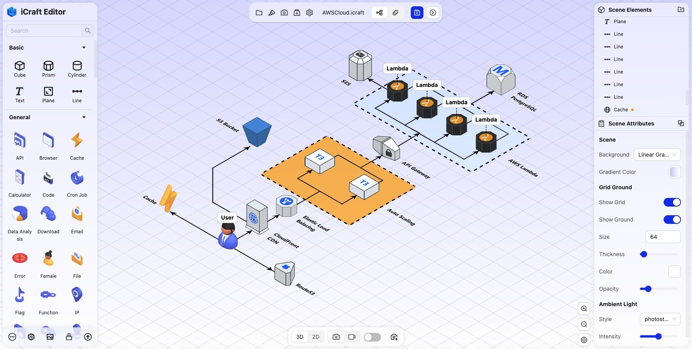
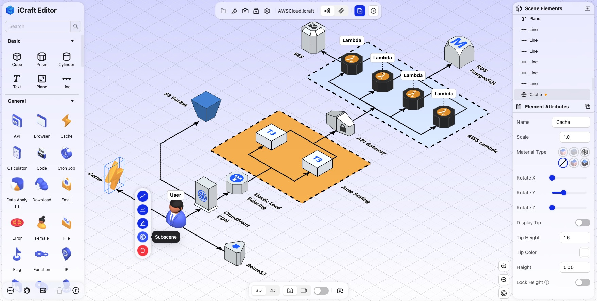
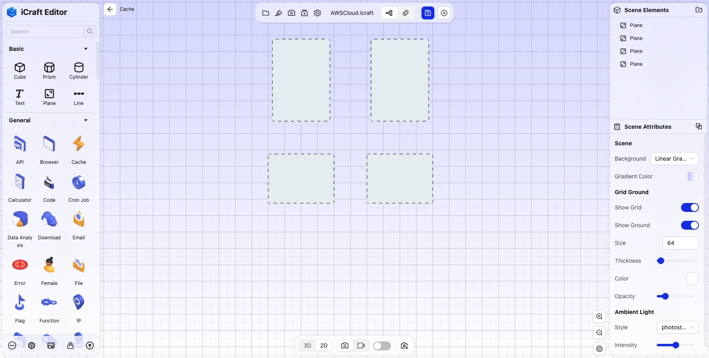
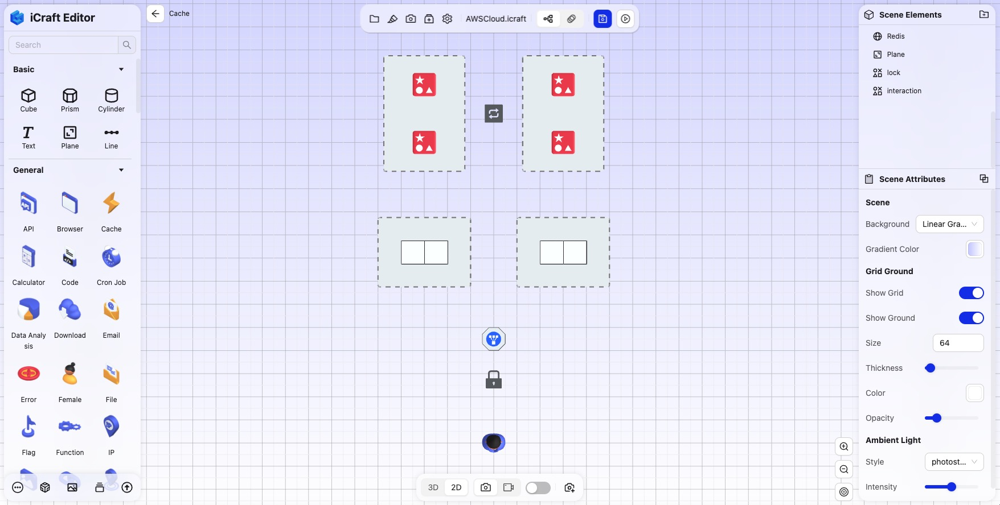
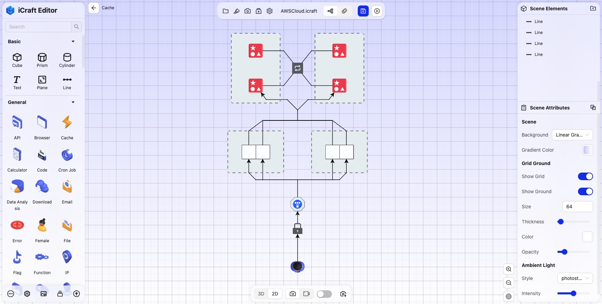
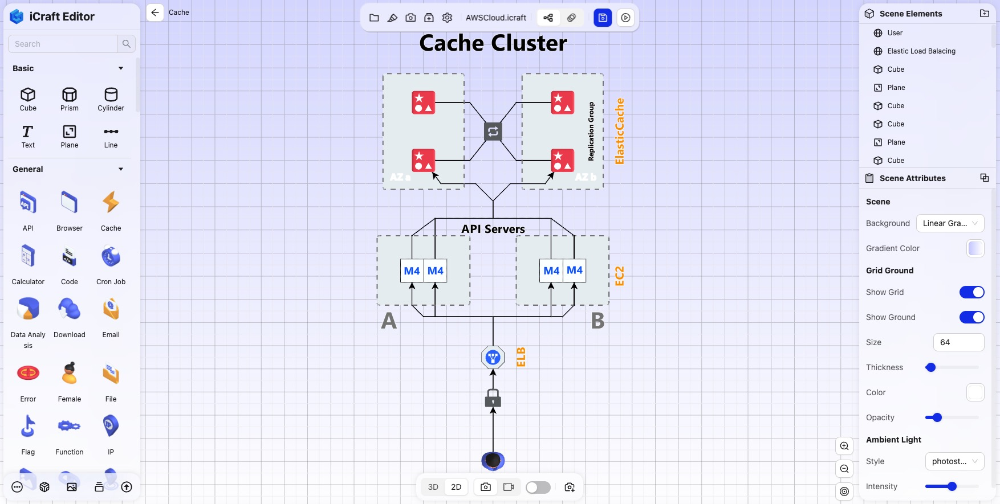
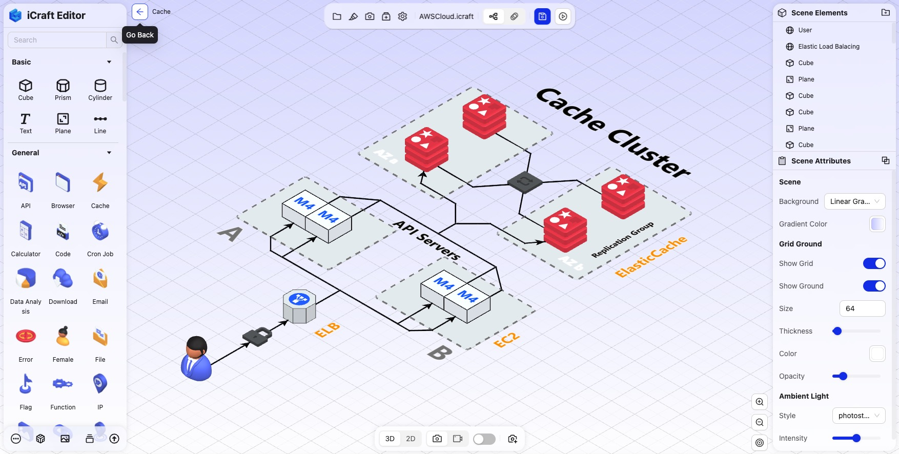

<!--
 * @Descripttion: 
 * @MainAuthor: 
-->

# How to Create 3D System Architecture Diagrams with Nested Subscenes

Creating 3D system architecture diagrams that support nested subscenes can further enhance the visual representation of system architectures, especially in complex or multi-layered structures. This method provides more flexible and detailed visualization capabilities.

## Advantages of Architecture Diagrams with Nested Subscenes

#### 1. Layered Display of Complex Systems

With nested subscenes, you can gradually reveal the various levels of a complex system. For instance, in a cloud architecture, you can start from a high-level overview of the cloud environment and drill down to virtual machines, containers, services, databases, etc. This layered approach simplifies the global view while allowing detailed inspection of individual components, avoiding information overload.

#### 2. Clear Modular View

The nested structure makes the modular design of the system more intuitive. Different modules can be displayed as subscenes, clearly showing the internal composition of each module and its dependencies with external components. This helps in understanding the layered design and modular implementation of the system.

#### 3. Flexible Interactive Experience

Users can freely navigate through different levels of subscenes in the 3D system architecture, using clicks, zooming, and other actions to explore specific subscenes in detail. Compared to a flat, global diagram, nested subscenes allow dynamic displays of architecture at various levels, providing a more flexible and richer interactive experience.

#### 4. Information Hiding and On-Demand Display

Nested subscenes allow hiding complex details in the initial view, displaying only the key top-level structures. Users can expand and view the internal architecture of a module as needed. This on-demand display of information effectively reduces clutter, helping users focus on the parts they are currently interested in, thereby improving comprehension.

#### 5. Supports Large-Scale System Visualization

For large-scale systems, displaying everything at once can lead to information overload. With nested subscenes, different modules of the system can be managed separately, reducing complexity in the initial view. Users can then gradually delve into each module's details, making the visualization of large-scale architectures more feasible.

#### 6. Facilitates Debugging and Optimization

Nested 3D architecture diagrams help developers and operations teams locate issues more easily. By diving into specific subscenes, teams can perform detailed analysis of a particular module, identify performance bottlenecks or system flaws, and then conduct more targeted debugging and optimization.

## Steps to Create 3D System Architecture Diagrams with Nested Subscenes

#### 1. Open the iCraft Editor software, create a new file or open a previously saved one. In this example, we are using a pre-made AWS architecture diagram.

#### 2. Select an element and click the subscene button from the floating toolbar to enter the subscene of this element.

#### 3. The subscene is also a 3D scene where you can continue adding elements, adjusting positions, and connecting lines until the subscene meets your needs. You can switch to a top-down view with the V shortcut and use flat elements to divide large areas.

#### 4. Then, depending on the actual situation, continue to add technical components and drag them to different positions within the subscene.

#### 5. Connect elements based on their relationships using lines.

#### 6. Finally, add explanatory text to the technical components.

#### 7. Click the top-left return button to exit the subscene and go back to the parent scene.

ps: If you need to use the scene from another file as a subscene of an element in the current file, you can click "Import .icraft" from the main menu within the subscene.

## Recommended Use of iCraft Editor
Using iCraft Editor allows for quick and easy creation of 3D system architecture diagrams with nested subscenes. It provides powerful features like layered display, information hiding, and flexible interactions, making it especially suitable for showcasing large and complex system architectures. It helps users gradually understand the various layers of a system from the global view to the details, improving the efficiency of system analysis, design, and communication. This method is particularly useful for visualizing distributed systems, microservices architectures, large network topologies, and multi-platform systems.

iCraft Editor official website: https://icraft.gantcloud.com